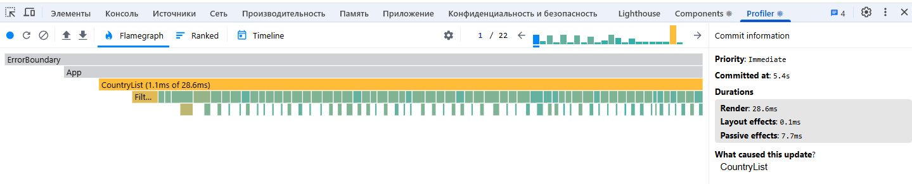
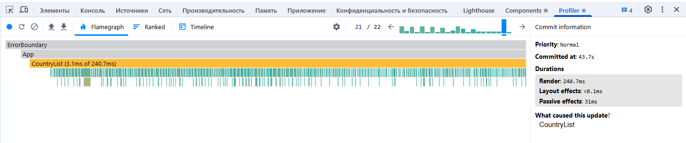
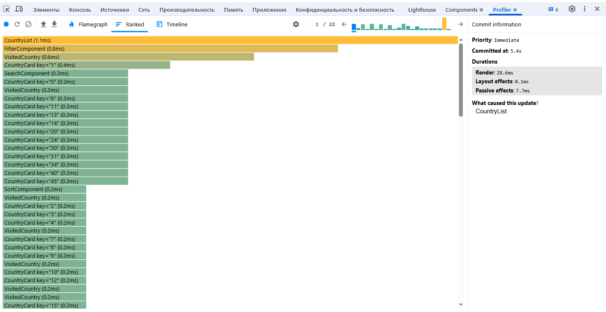
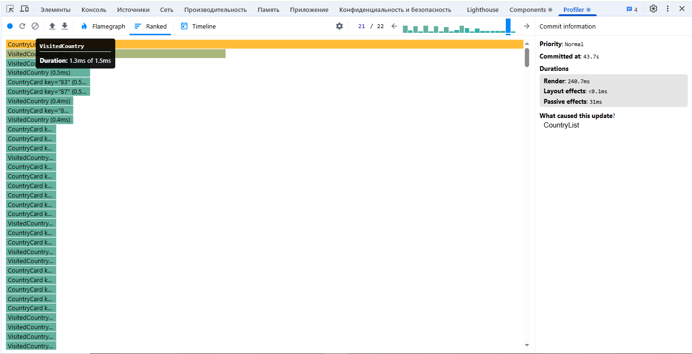
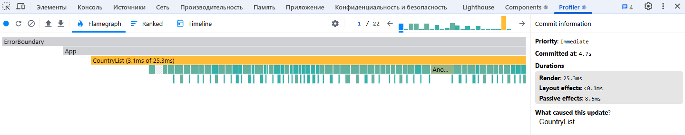
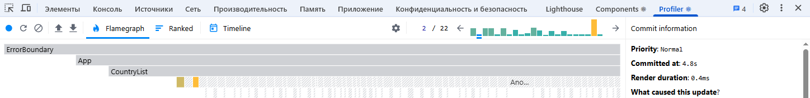
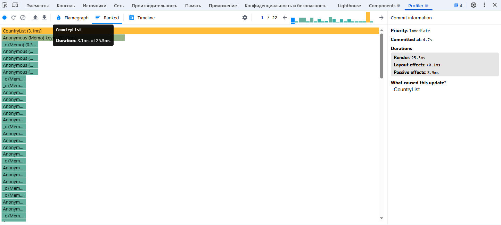
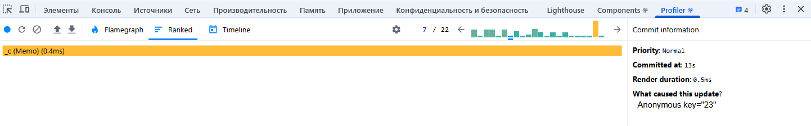

Trainee project for RS School

## Performance Analysis

I used the React Dev Tools Profiler to measure the performance of the application. Below are the results:

### Profiling with React Dev Tools Profiler before optimization:

#### Commit Duration
- Average commit duration: **23.47s**.
- Longest commit duration: **44s** (observed during saving the cards to locale storage).

#### Render Duration
- **CountryList**: 1.1ms
- **CountryCard**: 0.3ms
- **FilterComponent**: 0.8ms
- **SearchComponent**: 0.3ms
- **SortComponent**: 0.2ms
- **VisitedCountry**: 0.6ms

#### Interactions
- Sorting by population triggered a re-render of the `CountryList` component.
- Searching for a country triggered a re-render of the `CountryList` and `SearchComponent`.

#### Flame Graph
 
 

#### Ranked Chart

### Observations
- The `CountryList` component takes the most time to render, especially during sorting and saving the cards to locale storage.
- The `CountryCard` component is relatively fast but could be optimized further.
- No significant performance bottlenecks were found in the `FilterComponent` and `SearchComponent`.

### Profiling with React Dev Tools Profiler after optimization:

#### Commit Duration
- Average commit duration: **21.36s**.
- Longest commit duration: **38.2s**.

#### Render Duration
- **CountryList**: 1.1ms
- **CountryCard**: 0.3ms
- **FilterComponent**: 0.3ms
- **SearchComponent**: 0.2ms
- **SortComponent**: 0.1ms
- **VisitedCountry**: <0.1ms

#### Interactions
- Sorting by population doesn't trigger a re-render of the `CountryList` component.
- Searching for a country doesn't trigger a re-render of the `CountryList` and `SearchComponent`.

#### Flame Graph
 
 

#### Ranked Chart

### Observations
- The CountryList component now renders more efficiently, with noticeable improvements in sorting and saving cards to local storage.
- The CountryCard, SearchComponent, FilterComponent, SortComponent benefit from React.memo, reducing unnecessary re-renders when data remains unchanged.
- Memoization (useMemo) in useFilters hook has optimized computed values, preventing redundant recalculations.
- Event handlers wrapped in useCallback prevent unnecessary re-creations, improving performance in child components.

Overall, the optimizations have reduced unnecessary re-renders and improved the responsiveness of the application.